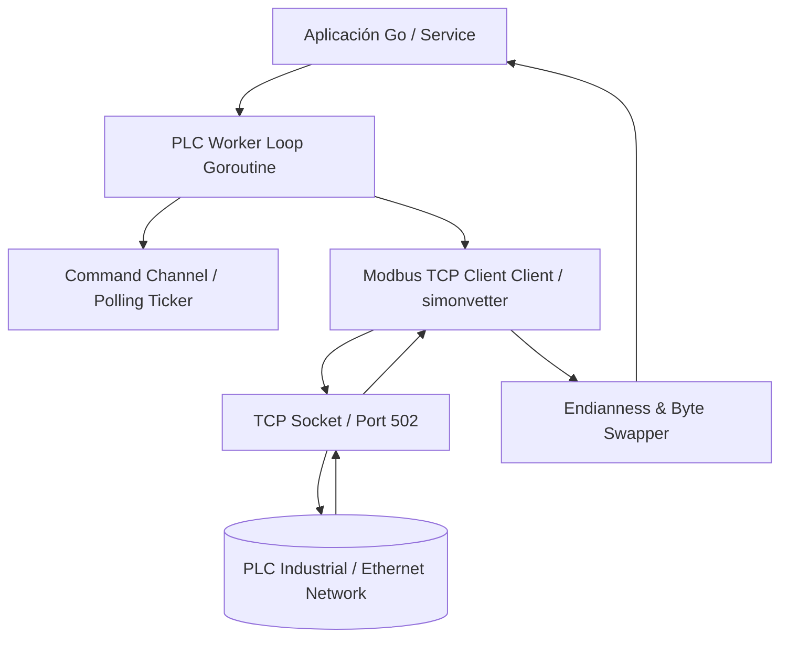

# 🦫🔌 Go PLC Modbus Agent Skill (`go-plc-modbus-agent-skill`)

> **Descripción** — Habilidad especializada para comunicación industrial Ethernet TCP/IP con PLCs (Siemens, Schneider, Omron, Delta, Beckhoff) utilizando **Go (Golang)** y el protocolo Modbus TCP.

---

## 📌 Propósito y Alcance

1. ⚡ **Conexión TCP Robusta**: Cliente Modbus TCP concurrente con reconexión automática y manejo de sockets colgados.
2. 🔄 **Lectura/Escritura Industrial**: Soporte para Holding Registers (FC03/FC06/FC16), Input Registers (FC04), Coils (FC01/FC05/FC15) y Discrete Inputs (FC02).
3. 🔢 **Conversión de Endianness & Datatypes**: Parsing idiomático de `float32`, `float64`, `int32`, `uint32` en formato BigEndian y LittleEndian / Swapped Word.
4. 🧵 **Worker Loop Concurrente**: Pipeline multihilo con `goroutines` y `channels` para polling periódico sin bloquear el hilo principal.
5. 🛡️ **Auditoría y Diagnóstico**: Verificación de conectividad, latencia de respuesta Ethernet y paridad de mapa de registros industrial (`$goplc:audit`).

---

## ⚡ $-Comandos de Dominio

| Comando | Acción | Descripción |
|---|---|---|
| `$goplc` | Bootstrap Skill | Carga los patrones y paquetes de comunicación Modbus TCP para Go. |
| `$goplc:audit` | Auditoría Industrial | Diagnostica la salud de las conexiones PLC Ethernet y registros mapeados. |
| `$goplc:read [ip] [port] [reg]` | Inspección de Registro | Genera código de prueba de lectura de registro Modbus TCP. |
| `$goplc:worker` | Scaffold de Worker | Genera un worker loop completo en Go con reconexión y polling. |

---

## 🧩 Arquitectura / Diagrama de Flujo



---

## 📦 Instalación como Submódulo

```bash
mkdir -p .skill
git submodule add git@github.com:Agent-Rules-Ecosystem/go-plc-modbus-agent-skill.git .skill/go-plc-modbus-agent-skill
```
