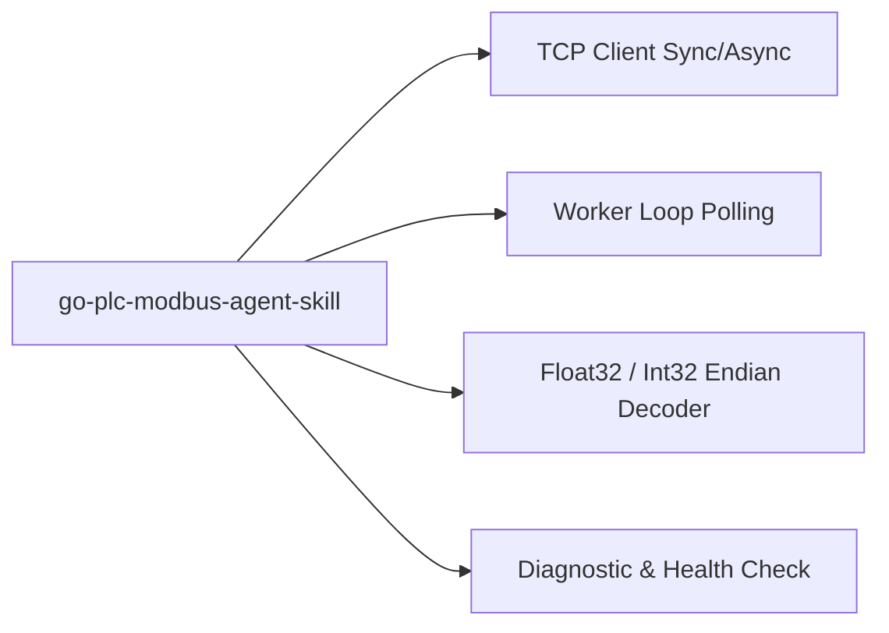

# 🦫🔌 Go PLC Modbus Skill Matrix & Directives

## 🎯 Capacidades de la Habilidad



## 📋 Protocolo de Auditoría Industrial (`$goplc:audit`)

Al ejecutar `$goplc:audit`, el agente verifica:
1. **Configuración de Red PLC**: Dirección IP, Puerto TCP (por defecto `502`), Slave ID / Unit ID (1 a 247).
2. **Resiliencia de Conexión**: Presencia de retries y reconexión en caso de caída de enlace Ethernet.
3. **Manejo de Errores de Protocolo**: Verificación de excepciones Modbus (Illegal Function Code, Illegal Data Address).
4. **Persistencia de Informe**: Escribir en `overview/work/skill/go-plc-modbus.md` la tabla de registros mapeados y su estado.

---

## 🛠️ Patrón Canónico de Código Go (`simonvetter/modbus`)

```go
package main

import (
	"fmt"
	"log"
	"time"

	"github.com/simonvetter/modbus"
)

func ConnectPLC(ip string, port uint16) (*modbus.ModbusClient, error) {
	client, err := modbus.NewClient(&modbus.ClientConfiguration{
		URL:      fmt.Sprintf("tcp://%s:%d", ip, port),
		Speed:    1,
		Timeout:  2 * time.Second,
	})
	if err != nil {
		return nil, fmt.Errorf("error configurando cliente modbus: %w", err)
	}

	err = client.Open()
	if err != nil {
		return nil, fmt.Errorf("error conectando a PLC en %s:%d: %w", ip, port, err)
	}

	return client, nil
}
```
